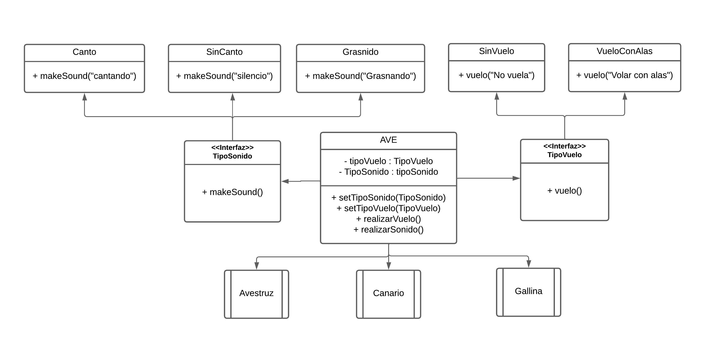
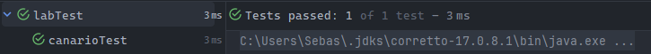

# Simulador de observacion de aves

## Diagrama

## Descripción
Este trabajo es un simulador de observación de aves, en el cual se simula sus carateristicas mediante promagramcion orientada a objetos **(POO)**.

### Test
